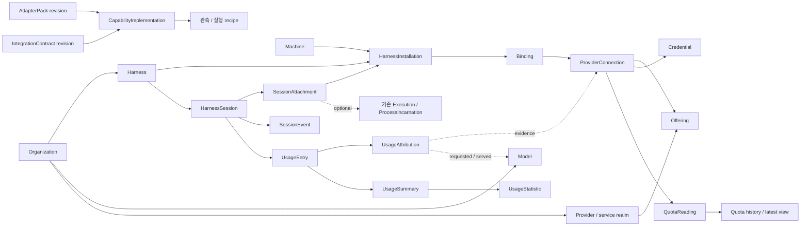

# mahas 통합·사용 이력 도메인 모델 초안

> **상태: 설계 제안(의미의 출처). 현재 스키마나 구현 목록이 아니다.**
>
> - **현재 저장 구조와 마이그레이션**: [docs/architecture/migration.md](docs/architecture/migration.md) — 물리 schema의 정본은 실행되는 migration이다.
> - **도메인별 구현 위치와 상태**: [docs/architecture/domains/README.md](docs/architecture/domains/README.md)
> - **기계 계약**: [docs/architecture/contracts/README.md](docs/architecture/contracts/README.md)
> - **검증 결과**: [docs/development/verification.md](docs/development/verification.md)
>
> 아래 본문은 논의로 정한 **의미와 불변식**의 출처다(예: unknown은 0이 아니다, 현재 설정을 과거 사용에 소급하지 않는다, 토큰 지분을 quota 소진 지분이라고 부르지 않는다). 필드 목록·테이블 목록이 필요하면 위 현재 문서와 코드를 본다.

입력: [domain-model-needs](domain-model-needs.md), 후속 대화의 통합 계약·소비자 측 구현·영속 이력 요구, 기존 mahas 실행/관측 모델.

## 1. 목표와 소유 경계

CLI 실행, 세션 이벤트, 토큰 사용, Provider quota, 인증 연결을 **공통 통합 도메인** 아래 모은다. 터미널·알림·usage·실행 런타임·향후 mahas agent는 이 도메인의 계약과 저장 객체를 소비한다.

mahas가 소유하는 것은 다음이다.

- 외부 하네스/서비스와 주고받는 버전된 계약과 의미.
- 구현체를 등록·호출하고 계약 충족 여부를 기록하는 공통 기반.
- 관측한 환경·세션·사용 사실, 수집 진행 상태, 영속 집계.
- 이 데이터를 조회·구독하는 공통 API와 실행 권한의 집행.

개별 CLI/config/log/API의 해석과 연결은 **사용자 환경의 통합 구현체**가 소유한다. mahas는 구현·수정을 돕는 skill과 계약 자료, 검증 수단을 제공한다. 사용자의 coding agent가 이를 소비하여 구현체를 만든다. 이후 mahas-agent/harness-engineer도 같은 계약과 진단 기록을 소비한다.

하나로 모은다는 것은 소유 경계와 소비 계약을 모은다는 뜻이다. 실행, 인증, 계측을 하나의 거대한 객체나 파일에 넣지는 않는다.

## 2. 전체 관계



Organization/Provider/Offering/Harness/Model은 공통 카탈로그의 객체이고, Installation/Connection/Session은 사용자 환경에 실제로 존재하거나 관측된 객체다. UI에서 Provider와 상품을 함께 보여주더라도 내부 identity는 분리한다. Credential 등은 내부 모델 용어다.

## 3. 제작·운영 주체와 환경·서비스·모델

공통 제작·운영 주체는 **Organization**으로 정규화한다. 대화에서 든 OpenAI를 예로 들면 Codex의 제작 주체와 Sol 모델의 제작 주체가 같은 Organization을 참조한다. 서비스의 운영 주체도 이 객체를 참조하지만, 제작사 identity가 인증 realm이나 실제 이용 상품을 결정하지는 않는다.

```text
Organization
  ├─ Harness               제작·배포하는 하네스
  ├─ Model                 제작·공개하는 모델
  └─ Provider              운영하는 서비스의 계정 realm
       └─ Offering         그 서비스의 상품
            └─ ProviderConnection
```

이는 ownership 관계의 예시다. Harness가 사용할 Model/Offering을 제한하는 contains tree가 아니다. 다른 Organization의 하네스로 어떤 서비스가 제공하는 모델을 사용할 수 있다.

| 객체 | 의미와 주요 필드 | 관계·불변식 |
|---|---|---|
| **Organization** | 제작·배포·서비스 운영의 공통 주체. `id, name, metadata` | 회사/커뮤니티 등 주체의 identity. 여러 Harness·Model·Provider가 참조한다. 계정 realm이나 사용자 billing 조직과는 별개 |
| **Machine** | 관측이 발생하는 머신. `id, label, firstSeenAt, lastSeenAt` | 재부팅·mahas 재시작에 독립적인 ID. 기존 ExecutionHost는 이 머신에서 동작하는 실행 서비스이며 host incarnation과 구별한다. v1은 로컬 한 대 |
| **Harness** | 소비 도구의 종류. `id, publisherOrganizationId?, label, identityMetadata` | `codex`, `cline` 등. 제작 주체를 참조한다. Provider 목록이나 quota 구현을 내장하지 않는다 |
| **HarnessInstallation** | 머신의 실제 하네스 설치/설정 인스턴스. `id, machineId, harnessId, executableLocator?, configNamespace, dataNamespace, firstSeenAt, lastSeenAt, presence` | 같은 Harness라도 별도 설정/데이터 영역이면 별개. 바이너리가 없어지고 로그만 남아도 과거 객체는 보존한다 |
| **InstallationRevision** | 관측한 실행 파일·버전·설정 구조의 변화. `installationId, revision, executableIdentity, version?, observedAt, evidenceRef` | 업그레이드 때 installation ID를 바꾸지 않는다. 인증값이나 전체 config를 fingerprint에 포함하지 않는다 |
| **Provider** | 서비스의 계정 realm. `id, operatorOrganizationId?, label, realm, metadata` | 같은 Organization도 분리된 계정 realm을 여러 개 운영할 수 있다. Harness/Model 제작사와 실제 서비스 운영자를 혼동하지 않는다 |
| **Offering** | Provider가 제공하는 상품. `id, providerId, key, label, metadata` | 기존 `family/variant`는 Offering의 식별 표현으로 유지한다. 인증 요구·quota 계약은 상품별로 연결한다. 현재 구독 등급·잔액은 Reading의 사실 |
| **Model** | 모델 자체의 정체성. `id, publisherOrganizationId?, label, version?` | Harness·Offering과 독립적. 같은 모델이 여러 서비스에서 제공될 수 있다. 미확인 제작사는 null이며 문자열 접두사만으로 채우지 않는다 |
| **Credential** | 저장된 로그인 재료의 논리적 참조. `id, machineId, materialRef, materialRevision, ownership, availability` | 원문 secret은 별도 저장소/원래 파일. materialRef는 복수 필드·토큰 세트를 가리킬 수 있다. 토큰 refresh는 같은 credential의 revision |
| **ProviderConnection** | 특정 credential로 특정 Offering에 접근하는 연결. `id, offeringId, credentialId, authScope?, firstSeenAt, availability` | 같은 상품의 여러 계정 지원. 같은 credential이 여러 offering을 허용하면 connection을 여러 개 만든다 |
| **Binding** | 하네스 설정이 ProviderConnection을 참조하는 사실. `id, installationId, connectionId, configSlot, selector?, origin, observedFrom, observedUntil?, evidenceRef` | N:M의 실체. 기본/모델별/역할별 선택 규칙을 기록하지만 실제 호출 사실로 간주하지 않는다 |

`ProviderConnection`은 로그인 재료와 상품 연결을 분리한다. 동일 토큰 세트를 상품마다 복제하거나 credential 하나에 상품을 억지로 하나만 붙일 필요가 없다. quota 카드의 기본 조회 단위도 이 connection이다.

이 분리는 domain-model-needs의 상품 평탄화 방향을 후속 논의로 변경한 것이다. `openai/chatgpt` 같은 Offering ID가 있어도 Provider의 Organization 관계를 문자열 파싱으로 추론하지 않고 명시 참조로 따라간다. Organization 이름·공통 metadata도 Harness/Model/Provider마다 독립적으로 복제하지 않는다.

**identity 규칙**

- Credential의 material revision은 비밀값의 세대이고, Connection의 account identity는 관측 사실이다. 같은 파일에서 다른 계정으로 로그인한 것이 확인되면 과거 연결을 종료하고 새 Credential/Connection을 만든다. 단순 토큰 refresh와 계정 교체를 구별할 증거가 없으면 미확인 상태를 남긴다.
- 계정 이메일·Provider의 account ID·조직 ID는 출처와 관측 시점을 가진 identity claim으로 저장한다. 이메일이 같다는 이유로 Credential/Connection을 합치지 않는다.
- 자동 탐색과 수동 등록은 같은 모델을 생성하고 `origin`만 다르다. 탐색이 파일을 못 읽었다는 이유로 연결을 삭제하지 않는다. 확인된 설정 제거와 탐색 실패를 구별한다.
- Binding 변경은 이력을 남긴다. 오늘 발견한 설정을 어제 세션의 Provider 귀속으로 소급하지 않는다.
- ProviderConnection이 직접 등록되어 quota만 조회되는 경우 Binding이 없어도 된다.
- 여러 connection이 같은 quota pool을 관측할 수 있다. Provider가 알려준 pool identity는 저장하고, 중복 카드 표시 정책은 projection이 맡는다. quota 잔액을 connection별로 무조건 합산하지 않는다.
- Model의 제작 Organization, Harness의 제작 Organization, 실제 이용한 Provider의 운영 Organization은 서로 독립된 분석 축이다. 다른 서비스로 모델을 이용해도 모델 제작사가 그 사용의 과금 상대가 되었다고 추론하지 않는다.
- native 모델 이름/alias는 Offering 또는 Harness의 namespace와 함께 보존한다. canonical Model 연결에는 출처와 유효 시점을 둔다. 같은 문자열이라는 이유로 다른 모델을 병합하거나, 오늘 alias가 가리키는 모델을 과거 사용에 소급하지 않는다.

## 4. 통합 계약과 소비자 측 구현

| 객체 | 의미 | 주요 필드 |
|---|---|---|
| **IntegrationContract** | mahas가 요구하는 특정 capability의 입력·출력·의미·실패 계약 | `id, revision, schemaDigest, semanticsDigest, compatibility, conformanceCases` |
| **AdapterPack** | 사용자가 설치하는 통합 구현 단위 | `id, revision, contentDigest, subjectRefs, implementations, requirements` |
| **CapabilityImplementation** | Pack 안의 capability 구현 | `capability, contractRevision, entrypoint, mode, supportDeclaration, limits` |
| **IntegrationCheck** | 특정 구현·설치·계약 조합을 확인한 기록 | `packRevision, installationRevision? / connectionId?, contractRevision, capability, checkedAt, result, evidence, diagnostics` |
| **IntegrationIssue** | 변경이나 실패로 생긴 수정 대상 | `targetRef, capability, reason, detectedAt, status, evidenceRefs, resolvedByRevision?` |

Pack의 물리적 기본안은 manifest와 선언형 규칙/스크립트/fixture를 포함하는 디렉터리다. `harness pack`과 `provider probe`는 같은 패키징·호출 기반을 쓰되 책임은 각각 분리한다. Pack 하나가 여러 주제를 포함할 수 있지만 Harness와 Provider 사이에 고정된 짝을 만들지는 않는다.

### Capability 목록

| 대상 | Capability | mahas가 받는 것 |
|---|---|---|
| Harness | `identify` | 설치·바이너리·프로세스의 정체성 관측 |
| Harness | `launch` | 실행·역할 구성품 설치·필수 입력 전달 recipe와 지원 범위 |
| Harness | `resume` | session handle에 대한 재개 recipe와 전제조건 |
| Harness | `wake` | 안전하게 추가 입력을 전달할 수 있는 검증된 방법과 한계 |
| Harness | `events` | native 이벤트/출력의 canonical SessionEvent 변환 |
| Harness | `sessions` | 세션 목록·handle·parent 관계·메타데이터의 증분 발견 |
| Harness | `usage` | 요청별/누적 계측과 ProviderConnection·요청 모델·실제 모델의 관측. 각 귀속 축의 지원 수준 포함 |
| Harness | `bindings` | config slot → credential/connection 관계 탐색 |
| Harness | `maintenance` | lock 정리 같은 특정 유지 작업의 전제조건·대상·수행 결과 |
| Provider / Offering | `auth` | realm과 상품의 등록·로그인·refresh 방식 및 credential 변경 결과 |
| Offering | `quota` | 상품별 quota·entitlement·identity·plan의 QuotaReading |

`notify` 대신 `events`로 둔다. Pack은 이벤트 의미를 해석하고, 알림 여부·배지·소리는 알림 소비자의 정책이다. subagent suppression도 정보를 버리는 정규화가 아니라 알림 정책으로 이동한다.

**지원과 실제 상태는 별개다.**

- 선언: `implemented | unsupported`. 알려진 capability는 미지원 이유와 함께 명시한다. 누락은 미확인이며 지원으로 간주하지 않는다.
- 확인 상태: `unchecked | compatible | incompatible | degraded`. capability별로 관리한다. `events`가 깨져도 검증된 `usage`까지 모두 꺼지지 않는다.
- 소비자는 필요한 capability 집합을 선언한다. usage 조회가 launch를 요구하지 않고, 역할 실행은 자신에게 필요한 launch/input 계약을 요구한다.
- 활성 실행은 기존 LaunchPlan의 profile/Pack/입력 revision pin을 유지한다. Pack 갱신이 진행 중인 실행의 recipe나 역할 지침을 암묵적으로 바꾸지 않는다.
- 계약/Pack/설치 revision과 설정 구조 변화, schema 위반, 검증 사례 실패, 실행 중 실패를 통해 변경 후보를 만든다. **변경 감지와 의미적 파손 확정은 다르다.** 출력 형태가 그대로인 상위 서비스의 의미 변경까지 자동 검출한다고 약속하지 않는다.
- mahas는 특정 CLI의 새 옵션·로그 필드를 스스로 추측하여 보정하지 않는다. 문제의 범위와 증거를 기록하고 coding agent가 skill을 통해 구현을 갱신한다.

**Skill이 제공할 작업 단위:** 현재 계약 읽기 → 로컬 설치/config/fixture 조사 → Pack 작성 → capability별 검사 → 새 immutable revision 등록. Skill은 작업 방법이며, 기계가 소비하는 schema와 의미 계약의 두 번째 정본이 아니다. 이번 초안에서는 skill 자체를 구현하지 않는다.

**호출 경계:** 선언형과 스크립트는 같은 요청/응답 envelope를 쓴다. 요청은 capability·대상 참조·cursor·operation ID, 응답은 관측 batch/recipe·다음 cursor·진단이다. Pack은 mahas DB의 writer가 되지 않는다. launch/stop/설정 변경/인증 refresh 등의 effect는 기존 권한·intent/receipt 경계를 따른다. 임의 스크립트의 OS 접근을 이 계약만으로 격리했다고 간주하지 않는다.

Credential 원문은 필요한 auth/probe 호출에만 전달하고 모델 입력·argv·일반 진단 기록에서 제외한다. 공유 credential의 refresh는 material revision을 확인하고 직렬화한다. refresh 응답 유실도 조회 실패와 구별되는 변경 effect다.

## 5. 세션과 실행

| 객체 | 의미와 주요 필드 | 불변식 |
|---|---|---|
| **HarnessSession** | 하네스가 유지하는 대화/작업 이력의 정체성. `id, harnessId, originMachineId?, namespace, nativeSessionKey, parentSessionId?, title?, firstObservedAt, lastObservedAt` | 실행 종료·앱 종료·원본 삭제 뒤에도 남는다. mahas 밖에서 시작한 세션도 포함 |
| **SessionHandle** | 해당 세션을 native 도구에서 찾거나 재개하는 참조. `sessionId, installationId?, nativeId, locator?, resumeSupport, evidenceRef` | 이 참조의 존재가 현재 프로세스 생존이나 재개 가능성을 보증하지 않는다 |
| **SessionAttachment** | 한 세션과 특정 설치/프로세스/mahas 실행의 연결. `sessionId, installationId?, machineId, processIdentity?, executionId?, observedFrom, observedUntil?, evidenceRef` | 세션 재개마다 다른 process와 연결될 수 있다. 과거 로그만 있으면 process/Execution 없이 기록 |
| **SessionEvent** | 세션에서 관측한 사건. `sessionId?, attachmentId?, kind, nativeKind, nativeTurnId?, occurredAt?, observedAt, origin, evidenceRef` | 기존 ObservationFact 계열의 typed payload. 별도 이벤트 원장을 중복 만들지 않는다 |

Session은 기존 **NativeConversation 개념을 영속 객체로 확장**하는 이름이다. 기존 Execution.nativeConversation은 session/handle 참조로 이관한다. 별도의 대화 정본을 두 개 유지하지 않는다. 기존 Member는 협업 책임자, Execution은 권한 있는 실행, Task/Dispatch는 업무/시도라는 의미를 유지한다.

- 세션 키는 Harness + native 저장 namespace + native ID가 기본이다. namespace는 일반적으로 machine/data root에 묶인다. 경로 이전을 증명하면 namespace alias를 추가한다. ID 접미사 비교로 합치지 않는다.
- 여러 머신에서 복제된 로그는 provenance를 남기고, 같은 이력이라는 증거가 있을 때 연결한다. origin machine을 알 수 없으면 현재 import 머신을 실행 머신으로 둔갑시키지 않는다.
- 한 프로세스가 여러 세션을 다루거나 한 세션이 여러 실행에 연결되는 경우를 허용한다. Attachment가 관계와 시간을 표현한다.
- `session-end`는 해당 참여/실행 구간이 끝났다는 관측이다. 세션 이력 삭제나 mahas Task 완료를 뜻하지 않는다.
- 초기 canonical kind는 기존 `session-start/end`, `turn-start/complete/cancelled`, `needs-input`, `idle`, `error`, `other`를 잇는다. 각 kind는 의미 계약·관측 범위를 가진다. 모르는 native 사건은 `other + nativeKind`로 남긴다.
- parent/subagent의 정체성과 이벤트는 보존한다. 알림에서 제외하더라도 사용량·세션 분석에서는 필요하다. native child session을 mahas Member로 승격하지 않는다.
- mahas 밖의 세션도 수집하되, 알림 대상과 실행 제어권은 기존 정책으로 결정한다. 현재의 `ours` 필터를 전체 이력 수집의 필터로 사용하지 않는다.

## 6. 관측과 영속 수집

공통 `Reading`은 버전된 관측 envelope이며 payload는 `UsageReading`, `QuotaReading`, 세션/설치/Binding 관측 등으로 구별한다. 숫자와 임의 label만 있는 단일 거대 스키마로 만들지 않는다.

| 객체 | 저장하는 것 |
|---|---|
| **CollectionSource** | `id, machineId, subjectRef, locator, kind, sourceGeneration, identityEvidence, status`. 파일·DB·hook stream·Provider API 등 실제 수집 원천 |
| **CollectionCursor** | `sourceId, generation, collectorRevision, position, checkpointRevision, lastCommittedAt`. 원천별 진행 위치와 parser 호환성 |
| **CollectionBatch** | `id, sourceRef, packRevision, contractRevision, cursorBefore/After, startedAt, committedAt?, result, diagnostics`. 수집 시도와 성공/부분 실패 |
| **Reading / ObservationFact** | `id, batchId, sourceRecordKey, sourceRecordRevision?, observedAt, occurredAt?, payloadSchema, payload, evidenceRef`. 수집한 사실 |
| **CollectionCoverage** | `source/subject, interval?, completeness, gapReason?, lastSuccessAt`. 어느 범위까지 실제로 관측했는가 |

Reading은 기존 ObservationFact 저장 모델을 확장해 수용한다. usage/quota용 typed 저장 테이블이 필요해도 같은 observation ID를 참조한다. 원본 transcript 전체 복제는 요구하지 않는다. 재정규화에 필요한 **계측 원필드, native 식별자, 의미/단위 정보**는 보존하되 프롬프트·credential은 수집하지 않는다.

**증분 수집 규칙**

1. 파일은 identity/generation과 확정 byte offset, DB는 안정적인 행 키 및 변경 watermark, API는 공식 cursor 또는 관측 시점을 사용한다. append-only가 아닌 DB는 PK 이후 행만 읽는 것으로 충분하지 않다. 변경 revision·안정 정렬 키·겹침 재조회 등 해당 source의 갱신 특성에 맞는 계약을 요구한다.
2. 한 batch의 관측 저장·중복 판정·계측 반영 의도와 cursor 전진을 mahas.sqlite의 한 transaction으로 commit한다. 실패하면 같은 batch를 다시 읽어도 중복 계상하지 않는다. collector는 source별 checkpoint CAS를 사용한다.
3. JSONL의 미완성 마지막 줄은 소비하지 않는다. 파싱할 수 없는 완성 레코드는 위치·진단을 격리 보존하고 coverage gap을 남긴 뒤 다음 레코드로 진행할 수 있다. 실패를 사용량 0으로 바꾸지 않는다.
4. truncate/rotation/replacement는 source generation 변경이다. **파일 세대 변경은 사용량 카운터 초기화와 다르다.** 재읽기 때도 native usage identity를 기준으로 중복을 판정한다.
5. source가 사라져도 Session/Reading/UsageEntry/Summary는 삭제하지 않는다. 수집 실패·source 소실과 사용량 감소는 별개다. 이미 사라져 수집하지 못한 과거는 복구된 것으로 표기하지 않는다.
6. Pack/parser 변경은 cursor 호환성을 검사한다. 재해석이 필요하면 보존된 계측 evidence와 원본 중 이용 가능한 것을 읽어 정정 revision을 만든다. 원본이 없어 복원 못 하는 필드는 미확인으로 남긴다.

UI는 DB를 조회하고 별도 refresh를 요청한다. 조회 자체가 모든 하네스 저장소의 재스캔을 일으키지 않는다. 수집은 UI 수명과 분리하여 mahasd가 관리하고, 외부 collector는 bounded batch를 제출한다.

## 7. 토큰 사용 원장

### 7.1 관측, 계상, 귀속, 집계를 나눈다

| 객체 | 역할 | 주요 필드 |
|---|---|---|
| **UsageReading** | 원천이 보고한 계측 사실 | `sessionId?, measurementKey, mode, counterScope?, counterEpoch?, values, semantics, timeCoverage, sourceEvidence` |
| **UsageEntry** | 중복·겹침을 판정한 영속 사용 원장 항목 | `id, revision, sessionId?, harnessId, installationId?, originMachineId?, accountingKey, coverageRef, readings, usageTime, normalizedTokens, cost?, accountingStatus, supersedes?` |
| **UsageAttribution** | 사용 항목의 서비스·상품·credential·모델·실행 귀속 | `entryId, revision, providerId?, offeringId?, connectionId?, requestedModelRef?, servedModelRef?, executionId?, dispatchId?, basis, evidenceRefs, status` |
| **UsageSummary** | 머신·기간·세션·Harness·Provider·Offering·Model/조합별 저장 집계 | `key, dimensions, timeBucket?, totals, coverage, attributionCoverage, definitionRevision, ledgerWatermark, attributionWatermark, computedAt` |
| **UsageStatistic** | 주간 평균·시간대별 분포 등 정의와 근거를 가진 저장 통계 | `id, definitionRevision, metric, dimensions, range, timeZone, calendarPolicy, value/buckets, numerator, denominator?, coverage, sourceWatermarks, asOf, computedAt` |

UsageAttribution은 데이터가 더 발견되면 정정할 수 있다. 원래 사용량을 다시 적재할 필요가 없다. `offeringId`는 알려지고 `connectionId`만 모르는 경우도 허용한다. connection이 알려지면 Offering/Provider는 그 참조에서 파생하며 별도의 충돌하는 사실로 저장하지 않는다. 추정 귀속과 확인된 귀속을 구별하며, 현재 Binding은 과거 귀속의 증거로 쓰지 않는다.

세션의 Provider/Model을 단일 고정 속성으로 두지 않는다. 사용 항목마다 귀속을 기록하므로 한 세션에서 서비스나 모델을 바꾸어도 집계할 수 있다. `ModelRef`는 `{nativeName, namespace, modelId?, mappingEvidence?}`이며 요청한 모델과 실제 처리한 모델을 분리한다. 실제 모델이 확인되지 않으면 요청 모델을 실제 모델로 복사하지 않는다.

usage capability는 provider/offering/connection/requestedModel/servedModel 각 축에 대해 `per-record | per-counter | unavailable` 관측 수준을 선언한다. 모델별 카운터라면 모델별 증분 계상이 가능하다. 여러 모델이 섞인 세션 전체 누적값과 현재 모델만 제공하면 과거 사용을 모델별로 나누지 않는다. 변경 시각만으로 정확한 사용량 분할을 발명하지 않는다.

Session을 아직 확인하지 못한 사용량도 원천이 안정적인 항목 식별자와 범위를 제공하면 저장한다. 임의의 가짜 세션을 만들지 않는다. 나중에 증거가 나오면 명시적으로 연결한다.

### 7.2 숫자의 의미

UsageReading의 `mode`는 다음 중 하나다.

- `delta`: 특정 요청/계측 단위에서 새로 발생한 양.
- `cumulative`: 명시된 counter scope/epoch 안에서 현재까지의 누적값.

정규화 목표는 `inputTotal`, `outputTotal`, `total`, `cacheReadInput`, `cacheWriteInput`, `reasoningOutput`이다. cache는 input의, reasoning은 output의 세부 항목이다. 구현체는 원천의 포함/제외 관계를 선언하고 변환한다. **cached가 input보다 크다는 숫자 비교로 관계를 추정하지 않는다.**

- 전체 값을 구할 수 없으면 null/unknown이다. 없는 필드를 0으로 채우지 않는다. 원천 보고 total과 검증 가능한 계산 total이 다르면 값을 덮지 않고 불일치를 기록한다.
- 서로 겹치지 않는 input/output이 확인되면 total을 계산할 수 있다. 세부 cache/reasoning을 total에 다시 더하지 않는다. 부분 계측만 있는 경우 집계에도 completeness를 동반한다.
- 비용은 `amount, currency, basis: reported/estimated, pricingRevision?`으로 별도 저장한다. Provider credit과 실제 통화 비용을 합치지 않는다.
- 토큰 총량은 해당 하네스/서비스가 보고한 토큰 소비의 합이다. 서로 다른 모델의 작업량·성능을 동일 단위로 비교했다는 의미는 아니다.

### 7.3 누적값과 중복

- 같은 scope/epoch의 누적 100 → 150은 총 150이다. 매번 100과 150을 더하지 않는다. entry에는 초기 baseline 100과 증가분 50의 근거를 남길 수 있다.
- 최초 관측이 lifetime 누적 100이면 all-time 기준값으로 보존한다. 실제 사용 시점을 모르면 오늘 사용량으로 넣지 않는다. 날짜를 모르는 과거 영역이 별도로 존재한다.
- counter가 감소하면 자동으로 음수 사용량이나 새 0 baseline을 만들지 않는다. 명시 reset인지, 수정된 snapshot인지, 다른 범위인지 확인될 때까지 새 관측을 보류하고 기존 확인 총량을 유지한다. reset 후 합산은 이전 범위와 겹치지 않음이 확인될 때만 한다.
- 두 관측 사이 증가분의 시간은 최소한 `(이전 관측, 이번 관측]` 범위다. 자정을 가로질렀다고 임의로 두 날에 나누거나 수집일에 몰지 않는다. 정확한 일별 귀속이 불가능한 양을 따로 반환한다.
- source row/이벤트 재읽기는 stable key로 멱등 처리한다. 내용 hash만으로 서로 다른 동일량 요청을 합치지 않는다. source-native ID가 없으면 source identity+generation+확정 위치를 쓰고, 다른 source 사이 동일성은 별도 증거를 요구한다.
- 같은 사용의 hook 이벤트·로그 행·DB 누적합은 독립 소비가 아니다. Pack은 측정 범위와 서로 겹치는 스트림을 선언한다. 기본 계상 스트림을 coverage별로 고정하고 다른 스트림은 대조 증거로 남긴다. 스트림 교체는 기존 항목과 대조/정정 후 수행한다.
- parent 누적값이 child 사용을 포함하면 child를 다시 더하지 않는다. child별 세부 집계를 위해 명시된 allocation/overlap 관계를 저장한다. 관계가 불명확하면 임의 차감하지 않고 대안 관측을 보류한다.

`coverageRef`는 계측이 덮는 session/request/counter 범위와 포함 관계를 가리킨다. 전체 합계는 겹치지 않는 범위들의 합이고, 세션 조회는 해당 범위의 포함 사용량과 직접 사용량을 구별한다. parent 100/child 30처럼 겹치는 세션 순위 행을 다시 더해서 전체 130으로 만들지 않는다.

`accountingStatus`는 `counted | duplicate | unresolved | superseded`를 구별한다. 합계에는 유효한 counted revision만 사용한다. unknown 귀속의 사용은 전체/Harness 합계에 남고 Provider 합계에서는 미확인 범주에 남는다. 중복 여부가 unresolved인 관측은 확정 합계를 부풀리지 않는다.

계측 중복 제거는 UI의 계정 카드 합치기와 다르다. **같은 사용을 두 번 더하지 않는 것은 원장의 계약**이고, 서로 다른 계정을 한 그룹으로 보이는 것은 projection 정책이다.

### 7.4 저장 집계

초기 UsageSummary의 정해진 집계 축은 다음이다.

- 세션별 누적 사용량.
- 머신 × Harness의 누적/일별 사용량.
- 머신 × Provider의 누적/일별 사용량.
- 머신 × Harness × Offering의 누적/일별 사용량.
- Model별 및 Harness × Offering × Model의 누적/일별 사용량. 요청 모델/실제 모델 구분과 미확인 범주를 유지한다.
- 필요한 경우 위 집계의 Connection별 세부 구분. Organization별 집계는 하네스 제작/모델 제작/서비스 운영 중 어느 관계를 사용했는지 명시한다.

시간별·일별·주별 bucket을 지원한다. `timeBucket`은 `grain, startUtc, endUtc, timeZone, weekStart?`를 포함한다. 기본 저장 집계와 등록된 통계 정의에 필요한 조합을 유지하며, 모든 차원의 조합을 무조건 미리 생성하지 않는다.

Summary는 재시작 후에도 조회 가능한 저장 객체다. 새 entry·정정·귀속 변경에 따라 증분 갱신하고, 재구축은 원본 JSONL이 아니라 mahas의 원장을 사용한다. 과거 귀속을 바꾸면 이전 bucket에서 빼고 새 bucket에 더한다.

원장 commit은 aggregate 갱신 intent를 같은 transaction에 남긴다. 집계 worker는 반영 위치와 집계 변경을 함께 commit하여 재시도 중 중복 반영을 막는다. 조회 결과에 원장/귀속 watermark와 pending 상태를 반환한다. 재구축 중에는 완성된 이전 집계 세대를 제공하고 새 세대를 원자적으로 공개한다.

순위는 저장된 Summary를 정렬해 얻는다. 모든 가능한 순위를 또 다른 독립 정본으로 두지는 않는다. machine total과 harness total처럼 겹치는 집계들을 합산해 다시 총량을 만들지 않는다.

동일한 계정/사용량 pool로의 연결이 확인된 여러 Connection은 그 범위를 명시해 Harness별 소비 지분을 조회할 수 있다. 비교 가능한 토큰 합계에 대한 지분과 실제 quota 소진 지분은 별개다. quota가 다른 단위/가중치를 사용한다면 해당 계측 또는 변환 근거 없이 토큰 비율을 quota 기여도로 표시하지 않는다.

### 7.5 주간 평균과 시간대별 사용 패턴

시간 분석도 UI의 일회성 계산으로 끝내지 않는다. **UsageSummary는 기간별 합계**, **UsageStatistic은 기간·산식·분모가 명시된 평균/분포**를 저장한다. mahas agent가 같은 통계를 근거로 사용할 수 있어야 한다.

**사용 시각과 수집 시각**

`UsageEntry.usageTime`은 다음 중 하나다.

- `point`: 원천이 보고한 사용 시각과 `basis`(요청 완료 등). 요청 완료 시각에 해당 요청의 토큰을 계상하면 그 기준을 명시한다. 초 단위 실제 소비 시점을 관측한 것으로 설명하지 않는다.
- `interval`: 사용이 발생했다고 확인된 `(start, end]` 범위와 정밀도. 누적 counter 관측 사이 증가분 등이 해당한다.
- `unknown`: 시각을 모르는 과거 baseline 등.

원천의 timestamp/offset과 정규화한 UTC 시각, mahas가 수집한 `observedAt`을 구분해 보존한다. 시간대 정보가 없는 native 시각은 해석 근거와 불확실성을 남긴다. 집계 기본 timezone은 사용자 설정이며 현재 예시는 `Asia/Seoul`, 주 시작 기본안은 월요일이다. timezone/주 시작/계상 기준은 집계 key에 포함하여 다른 기준의 값을 섞지 않는다.

interval 전체가 한 bucket 안에 있으면 그 bucket으로 계상할 수 있다. 여러 시간대를 가로지르는 양은 더 세밀한 근거 없이 균등 배분하지 않는다. 일별 합계에는 넣을 수 있어도 시간별 분포에서는 미배분일 수 있다. 따라서 누적/주간/일간/시간별 coverage를 따로 표현한다.

**통계 정의**

| 통계 | 기본 정의 | 같이 저장할 근거 |
|---|---|---|
| 주간 평균 토큰 소비 | 선택 기간의 완결되고 수집 범위가 충분한 달력 주들의 합계 ÷ 해당 주 수. 기본 조회 예시는 최근 4개 완결 주 | 기대 주 수, 유효 주 수, 제외한 주와 이유, 분자/분모. 진행 중인 이번 주는 별도 부분 합계 |
| 특정 주의 하루 평균 | 해당 주에서 완결되고 수집된 날짜들의 합계 ÷ 해당 날짜 수 | 유효 날짜 수와 주간 평균과 다른 statistic kind |
| 날짜별 시간 단위 소비 | 각 날짜의 실제 1시간 bucket별 토큰 합계 | bucket 경계, 시간 귀속 기준, 미배분량 |
| 하루 중 시간대별 소비 분포 | 선택 기간에서 현지 시각 0시…23시 bucket을 각각 합산 | 범위·timezone·시간대별 coverage. 요일 × 시간대 분포로도 확장 가능 |
| 시간대별 평균 소비 | 각 시간대 합계 ÷ 그 시간대가 완전히 관측된 발생 횟수 | 시간대별 분모. 사용이 있었던 시간만 분모로 쓰지 않는다 |

수집이 확인된 범위의 무사용 기간은 **0으로 포함**하고, 수집 공백은 **unknown**으로 처리한다. 예를 들어 주별 100만·0·200만·100만 토큰이면 주간 평균은 100만이다. 두 번째 주가 수집 공백이었다면 0으로 간주하지 않고 유효 3주/기대 4주의 관측 평균임을 표시한다. 평균은 등록된 원천과 조회 범위에 대한 것이며 발견하지 못한 모든 사용까지 완전히 포괄한다고 주장하지 않는다.

현지 날짜/시간 bucket은 timezone의 실제 경계로 생성한다. 반복되는 현지 시각은 UTC 경계/offset으로 구별한 뒤 분포에서 묶는다. 단순히 일수 × 24를 분모로 가정하지 않는다.

모든 통계는 Harness/Offering/Connection/Model 등으로 필터·분해할 수 있다. 실제 모델 미확인량과 시간 미배분량을 숨기지 않는다. 예를 들어 “같은 ChatGPT 계정의 최근 4주 평균 중 Harness별 지분”과 “특정 모델을 주로 쓰는 시간대”를 같은 원장으로 계산한다.

late arrival·원장 정정·귀속 변경은 과거 bucket과 관련 통계를 갱신한다. 기간이 완결되거나 rolling window가 이동할 때는 새 사용 기록이 없어도 통계의 range/분모를 갱신한다. 저장 통계에 `asOf`와 원장/집계 watermark를 남겨 agent가 오래된 결과를 현재 결과로 오해하지 않도록 한다.

## 8. QuotaReading

Quota는 토큰 소비 원장과 별도 시간축의 관측이다. 잔량 변화에서 Session 사용량을 역산하지 않는다.

```text
QuotaReading
  connectionId, observedAt, providerMeasuredAt?
  identityClaims[]              // account/org/realm의 출처 있는 관측
  planClaims[]                  // Offering 안의 현재 등급·계약
  meters[]
    key, label, resource, scope, sharedPoolKey?
    unit                        // tokens, requests, currency, credits, ratio 등
    used?, limit?, remaining?, utilization?
    period? { kind, startsAt?, endsAt?, resetAt? }
    availability               // known / unknown / unlimited
  entitlements[]
    key, scope, value, validFrom?, validUntil?, evidenceRef
  status, diagnostics, sourceEvidence
```

Meter는 숫자로 잴 수 있는 한도/소비, Entitlement는 특정 모델/기능 사용 가능 같은 권리의 관측이다. 남은 비율만 알면 비율만 저장하고 가짜 limit을 만들지 않는다. 단위/기간/범위가 다른 meter를 합산하지 않는다.

각 Reading을 저장하고 최신 성공값은 별도 조회 projection으로 제공한다. fetch 실패는 실패 관측으로 남기고 이전 성공값을 지우거나 0으로 바꾸지 않는다. 조회 시 마지막 성공 시각과 현재 오류를 함께 알 수 있어야 한다. 원장/집계의 데이터 삭제는 source 소실에 연동하지 않고 별도의 명시 retention 정책으로만 수행한다.

## 9. 기존 아키텍처와의 접점

| 기존 개념/코드 | 이번 모델에서의 위치 |
|---|---|
| `HarnessProfile` | 특정 Harness의 launch/resume/wake 및 역할 구성품 로딩을 검증한 실행 profile. Pack revision/capability 구현을 참조하는 기존 도메인 객체로 유지. 별도 recipe 정본을 복제하지 않는다 |
| `RoleImplementation` | 역할 의미를 instruction/skill/tool로 구현하는 계층. Harness 통합 Pack과 별개. 선택한 HarnessProfile에 대한 pin은 유지 |
| `NativeConversation` | HarnessSession/SessionHandle의 기존 표현. 정규화된 ID 참조로 이관 |
| `Execution / ProcessIncarnation / Terminal` | 기존 수명·권한 정본. Attachment로 세션과 연결. 외부 세션을 발견했다고 가짜 Execution/Task를 만들지 않는다 |
| `ExecutionCredential` | mahas 협업 API 권한. Provider 로그인용 Credential과 별개 이름·타입·저장 경계를 유지 |
| `ObservationFact / SupportAttestation` | Reading/Event와 capability 검사 증거를 담는 기존 기반. IntegrationCheck는 capability 단위의 세부 검사, SupportAttestation은 실행 profile의 지원 판정에 연결 |
| `manifest.json`, hook installer/normalizer | Harness identity/events/resume Pack 구현으로 이동 |
| `ledger.ts` scanners | sessions/usage collector 구현으로 이동. 원장·집계·증분 checkpoint는 공통 기반 소유 |
| `usage.ts`, `usageAuth.ts` | Provider quota/auth 구현으로 이동. Credential/Connection lifecycle은 공통 기반 소유 |
| `devinLocks.ts` 등의 예외 | Harness maintenance capability 구현. 대상 확인과 effect 기록 계약은 공통 기반 소유 |
| renderer의 Provider 목록/switch | 등록 카탈로그와 capability/compatibility 조회로 대체 |

제어와 저장은 기존 `mahasd → mahas.sqlite` 단일 writer 원칙을 따른다. collector worker/Pack/UI는 직접 DB를 수정하지 않는다. execution-host는 계속 프로세스·PTY와 OS effect의 증거를 소유한다.

코드 경계의 기본안은 `integration`(계약/Pack/호출/검사), `inventory`(설치/인증/Binding), `sessions`(세션/관측), `metering`(수집/사용 원장/quota/집계)이다. 별도 패키지 수와 디렉터리 배치는 소스 정리 때 정하되, 소비자가 개별 CLI parser를 import하는 경로는 제거한다.

문서는 공통 계약·capability 의미·불변식의 정본, 구현 skill, Pack 자신의 설치/제한/검증 자료로 역할을 나눈다. 하네스 추가 때 AGENTS.md와 여러 기능 문서에 같은 특수 규칙을 반복해서 적는 구조를 줄인다.

## 10. 소비자가 얻는 저장 객체와 질문

| 질문 | 근거 |
|---|---|
| 내 머신에 어떤 하네스가 있는가? | Installation + 최근 identify 관측. 설치됨/현재 발견됨/과거에 있었음을 구별 |
| 실제로 어떤 하네스를 쓰는가? | Session/Attachment/사용 원장. 단순 설치와 실제 사용을 구별 |
| 지금까지 얼마나 썼는가? | UsageSummary + 미귀속·미확정·과거 coverage. 재스캔 없이 조회 |
| 어느 세션에서 많이 썼는가? | session Summary 순위와 원장 drill-down |
| 주당 평균 얼마나 소비하는가? | 주별 Summary와 UsageStatistic의 산식·유효 주 수·coverage |
| 주로 어느 시간대에 소비하는가? | 시간별 Summary와 현지 시간대 분포. 날짜별 시계열과 0…23시 패턴을 구별 |
| 어떤 Provider–Harness 조합을 설정했는가? | Binding 이력 |
| 어떤 Provider–Harness 조합을 실제 사용했는가? | 증거 있는 UsageAttribution + 조합별 Summary. 추정/미확인은 구분 |
| 어떤 상품에서 어떤 모델을 얼마나 사용했는가? | Offering × Model Summary와 요청/실제 모델의 관측 수준 |
| OpenAI 관련 사용량은 얼마인가? | Organization 관계를 하네스 제작/모델 제작/서비스 운영 중 어느 기준으로 조회하는지 구분 |
| 어느 하네스가 토큰을 가장 많이 썼는가? | Harness Summary. parent/child 또는 중복 stream의 겹침을 계상 단계에서 해소 |
| 어느 계정의 한도가 부족한가? | Connection별 최신 성공 QuotaReading + freshness/error |
| 어떤 통합을 고쳐야 하는가? | capability별 IntegrationIssue/Check와 해당 contract/Pack revision |

UI와 mahas agent는 같은 query/subscription 계약을 사용한다. agent에게 다시 로컬 JSONL을 파싱하라고 하지 않는다. 미래의 판단·제안·자동 개선은 이 저장 객체를 소비하는 별도 책임이며, 이번 도메인이 사용 패턴만으로 새 작업이나 설정 변경을 결정하지 않는다.

## 11. 이 모델을 검토할 구체 사례

1. 한 Harness에 서로 다른 Provider connection 6개를 등록하면 Binding 6개가 생긴다. 세션 사용량은 실제 선택 증거가 있는 connection에만 귀속한다.
2. 두 Harness가 같은 connection을 사용하면 quota 조회 대상은 하나이고, 사용 원장은 Harness별로 나뉜다. 서로 다른 credential이 같은 계정인 것처럼 보이면 identity claim만 보존하고 자동 병합하지 않는다.
3. 100 → 150 누적값을 재수집하거나 앱을 재시작해도 총량은 150이다. 원본 파일을 삭제해도 150과 그 근거는 유지된다.
4. 처음 수집한 10만 토큰의 과거 누적값에 시간 정보가 없으면 누적 총량에는 포함하고 오늘 사용량에는 포함하지 않는다.
5. 세션이 중간에 Provider를 바꾸면 요청별 귀속을 유지한다. 세션 누적값만 있어 분리 불가능하면 확인된 구간 외에는 Provider 미확인으로 둔다.
6. parent 100에 child 30이 포함된다는 계약이면 전체는 100이다. child의 30을 조회할 수 있어도 전체에 다시 더하지 않는다.
7. CLI 업그레이드로 events 형식만 깨지면 events Issue를 만들고 마지막 정상 자료를 보존한다. 정상 확인된 usage/quota 기능은 계속 쓸 수 있다.
8. mahas 밖에서 실행한 세션과 native subagent도 사용 이력에는 남는다. 발견만으로 mahas 실행 제어권이나 사용자 알림 대상이 되지 않는다.
9. Pack 수정으로 잘못 분류한 50 토큰의 Provider가 바뀌면 원장 총량은 그대로이며 두 Provider 집계만 정정된다. source가 이미 없어도 보존한 evidence 범위 안에서 가능하다.
10. Provider API가 실패하면 과거 quota Reading과 마지막 성공 시각을 반환한다. 실패를 잔량 0 또는 무제한으로 표시하지 않는다.
11. 같은 제작 주체의 Harness와 Model은 같은 Organization ID를 참조한다. 그 모델을 다른 Organization의 서비스로 사용하면 서비스별 집계와 모델 제작사별 집계가 서로 다른 관계를 따라간다.
12. 한 세션이 모델 X에서 Y로 바뀌어도 요청별 계측이 있으면 각각의 사용량을 집계한다. 요청 X가 fallback으로 Y에서 처리됐다는 관측이 있으면 요청/실제 모델을 별도로 보존한다.
13. 충분히 수집된 4주의 토큰이 100만·0·200만·100만이면 주간 평균은 100만이다. 무사용 주를 제외해서 평균을 높이지 않고, 미수집 주는 0으로 채우지 않는다.
14. 과거 로그를 오늘 가져와도 원래 사용 시각의 시간 bucket에 반영한다. 09:30~10:30 증가분만 알려진 100토큰은 임의로 09시/10시에 50씩 배분하지 않는다.

## 12. 이 초안의 제안 사항

핵심 선택은 **Organization을 공통 제작·운영 주체로 정규화**, **Provider와 Offering 분리**, **ProviderConnection 추가**, **NativeConversation을 영속 Session으로 확장**, **사용 항목별 서비스·모델·시간 귀속**, **원시 관측·사용 원장·영속 집계/통계의 구분**, **통합 상태를 capability별로 관리**다.

Organization과 Model은 실제 등록·관측한 대상을 정규화하기 위해 지금 포함한다. 전 세계 모델/가격 카탈로그의 완전한 사전 구축은 요구하지 않는다. Machine 간 자동 병합, 일반적인 독립 Agent 엔터티, 원격 실행 프로토콜은 별도 과제이며 기존 Member/Execution의 의미는 유지한다.

저장 공간 한도와 상세 quota/event 보존 기간, Pack 배포/업데이트 UX, skill의 이름과 물리 위치는 후속 설계 항목이다. **원본 소실이 수집 완료된 사용 이력의 소실로 이어지지 않는 것**은 그 선택과 무관하게 지킬 불변식이다.
