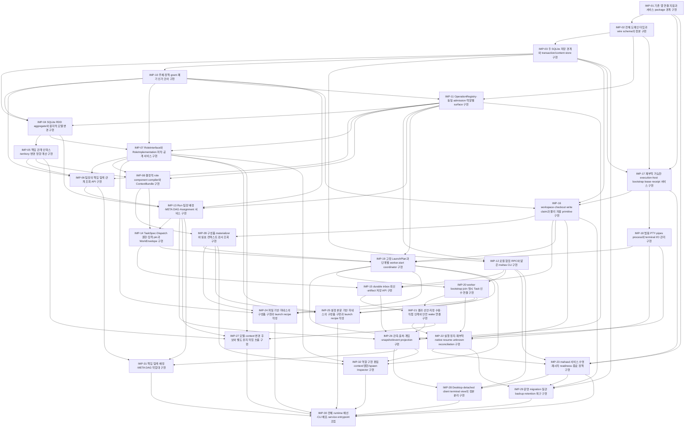

# 구현 의존 DAG

정본: [dag.json](dag.json). 아래 그림과 실행 가능 묶음은 그 그래프에서 생성한 projection이다. graph 자체가 자동 실행·재시도 정책을 결정하지 않는다.

## 선행 인계 기준의 실행 가능 묶음

| 묶음 | Task |
| --- | --- |
| 1 | [IMP-01](tasks/IMP-01/instruction.md) |
| 2 | [IMP-02](tasks/IMP-02/instruction.md) |
| 3 | [IMP-03](tasks/IMP-03/instruction.md) |
| 4 | [IMP-10](tasks/IMP-10/instruction.md), [IMP-17](tasks/IMP-17/instruction.md) |
| 5 | [IMP-11](tasks/IMP-11/instruction.md), [IMP-16](tasks/IMP-16/instruction.md), [IMP-18](tasks/IMP-18/instruction.md) |
| 6 | [IMP-04](tasks/IMP-04/instruction.md), [IMP-12](tasks/IMP-12/instruction.md) |
| 7 | [IMP-05](tasks/IMP-05/instruction.md), [IMP-07](tasks/IMP-07/instruction.md) |
| 8 | [IMP-06](tasks/IMP-06/instruction.md), [IMP-08](tasks/IMP-08/instruction.md) |
| 9 | [IMP-09](tasks/IMP-09/instruction.md), [IMP-13](tasks/IMP-13/instruction.md) |
| 10 | [IMP-14](tasks/IMP-14/instruction.md) |
| 11 | [IMP-15](tasks/IMP-15/instruction.md), [IMP-19](tasks/IMP-19/instruction.md) |
| 12 | [IMP-20](tasks/IMP-20/instruction.md) |
| 13 | [IMP-21](tasks/IMP-21/instruction.md), [IMP-24](tasks/IMP-24/instruction.md), [IMP-25](tasks/IMP-25/instruction.md) |
| 14 | [IMP-22](tasks/IMP-22/instruction.md), [IMP-26](tasks/IMP-26/instruction.md), [IMP-27](tasks/IMP-27/instruction.md) |
| 15 | [IMP-23](tasks/IMP-23/instruction.md), [IMP-31](tasks/IMP-31/instruction.md), [IMP-32](tasks/IMP-32/instruction.md) |
| 16 | [IMP-28](tasks/IMP-28/instruction.md), [IMP-29](tasks/IMP-29/instruction.md) |
| 17 | [IMP-30](tasks/IMP-30/instruction.md) |

각 묶음은 가능한 병렬성을 보여줄 뿐 반드시 같은 시각에 시작해야 한다는 뜻은 아니다. 실제 배정과 자원은 팀장이 결정한다.
