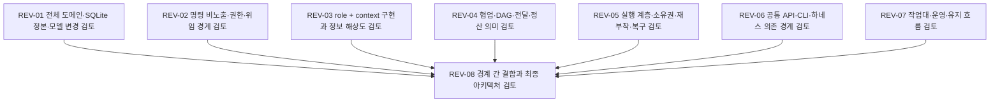

# 독립 review 의존 DAG

정본: [dag.json](dag.json). 아래 그림과 실행 가능 묶음은 그 그래프에서 생성한 projection이다. graph 자체가 자동 실행·재시도 정책을 결정하지 않는다.

## 선행 인계 기준의 실행 가능 묶음

| 묶음 | Task |
| --- | --- |
| 1 | [REV-01](tasks/REV-01/instruction.md), [REV-02](tasks/REV-02/instruction.md), [REV-03](tasks/REV-03/instruction.md), [REV-04](tasks/REV-04/instruction.md), [REV-05](tasks/REV-05/instruction.md), [REV-06](tasks/REV-06/instruction.md), [REV-07](tasks/REV-07/instruction.md) |
| 2 | [REV-08](tasks/REV-08/instruction.md) |

각 묶음은 가능한 병렬성을 보여줄 뿐 반드시 같은 시각에 시작해야 한다는 뜻은 아니다. 실제 배정과 자원은 팀장이 결정한다.
