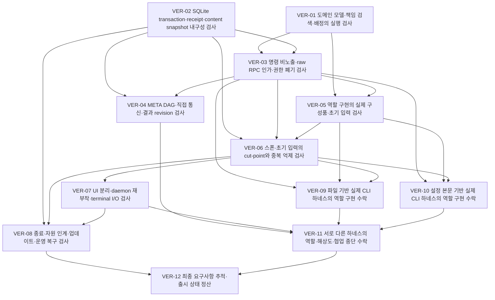

# 독립 verification 의존 DAG

정본: [dag.json](dag.json). 아래 그림과 실행 가능 묶음은 그 그래프에서 생성한 projection이다. graph 자체가 자동 실행·재시도 정책을 결정하지 않는다.

## 선행 인계 기준의 실행 가능 묶음

| 묶음 | Task |
| --- | --- |
| 1 | [VER-01](tasks/VER-01/instruction.md), [VER-02](tasks/VER-02/instruction.md) |
| 2 | [VER-03](tasks/VER-03/instruction.md) |
| 3 | [VER-04](tasks/VER-04/instruction.md), [VER-05](tasks/VER-05/instruction.md) |
| 4 | [VER-06](tasks/VER-06/instruction.md) |
| 5 | [VER-07](tasks/VER-07/instruction.md), [VER-09](tasks/VER-09/instruction.md), [VER-10](tasks/VER-10/instruction.md) |
| 6 | [VER-08](tasks/VER-08/instruction.md), [VER-11](tasks/VER-11/instruction.md) |
| 7 | [VER-12](tasks/VER-12/instruction.md) |

각 묶음은 가능한 병렬성을 보여줄 뿐 반드시 같은 시각에 시작해야 한다는 뜻은 아니다. 실제 배정과 자원은 팀장이 결정한다.
