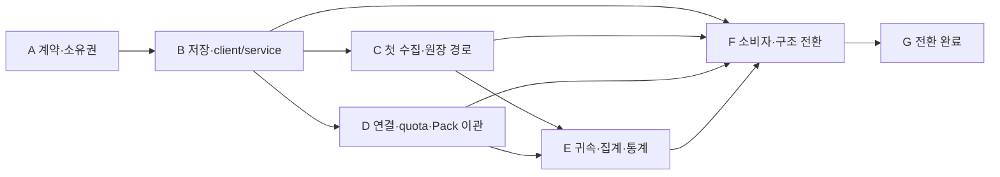

# 통합 도메인 구축 및 소스·문서 재편 계획

> **상태: 계획 문서와 수락 기준. 기능 통합 검증 및 0.5.0 패키징 완료, A–G 소스 재대조에서 기능 연결·증분 수집·공통화·리팩터링·호환 정리의 잔여 항목을 확인했다. 전체 완료 판정은 철회했으며 HANDOFF와 단계별 감사 기록을 따른다.**
>
> - **현재 구현된 내용과 검증 결과**: [docs/architecture/domains/README.md](docs/architecture/domains/README.md), [docs/development/verification.md](docs/development/verification.md)
> - **현재 저장 구조**: [docs/architecture/migration.md](docs/architecture/migration.md)
> - **이관 소유권(역사)**: [docs/plans/integration-migration-map.md](docs/plans/integration-migration-map.md)
> - **진행 상태의 정본**: [HANDOFF.md](HANDOFF.md)
>
> 아래 본문은 계획 작성 시점의 문구를 그대로 둔다. "구현 전", "미완료", "향후" 같은 표현은 **그 시점 기준**이며, 이번 마일스톤의 수락 기준은 §9에 남아 있는 그대로 유효하다. 구현으로 확정된 항목의 현재 설명은 위 문서들이 정본이다.

범위: 이번 마일스톤인 **도메인 모델 확장 + 소스 코드 구조 정리 + docs 시스템 개편**. 다음 마일스톤의 계획은 포함하지 않는다.

근거: [요구 배경](domain-model-needs.md), [후속 논의를 반영한 도메인 설계](domain-model-design.md), [기존 아키텍처의 의도](mahas-architecture/spec/architecture.md), 현재 소스의 정적 조사.

## 1. 이번 마일스톤의 결과

mahas가 Organization·Harness·Provider·Offering·Model, 설치·인증 연결, 세션·이벤트, 사용량·quota·통계를 공통 도메인으로 소유한다. 터미널, 알림, 사용량 화면, CLI, 실행 런타임이 같은 계약과 저장 객체를 소비한다.

개별 하네스의 설정·로그·API·실행 옵션은 외부 AdapterPack이 해석한다. mahas는 참여 계약, 호출 기반, 검사, 저장, 조회를 제공하고 사용자의 coding agent가 Pack을 작성·수정할 수 있는 skill을 제공한다. 기존 구현은 초기 Pack으로 이관한다.

완료된 상태에서 다음이 가능해야 한다.

- 내 머신의 설치 하네스와 과거 설치 이력, Provider 연결, Harness–Provider 조합을 조회한다.
- 앱 재시작이나 수집 원본 삭제 후에도 수집 완료된 세션·토큰 사용 이력이 남는다.
- 전체·하네스·세션·Provider·상품·모델별 사용량과 조합별 사용량을 같은 원장에서 조회한다.
- 같은 계정 또는 quota pool을 쓰는 연결이 확인되면 하네스별 **관측된 토큰 지분**을 조회한다. 귀속 미확인량도 함께 제공한다.
- 주간 평균과 시간대별 사용량을 기간·시간대·분모·수집 범위가 명시된 저장 통계로 조회한다.
- 새 통합을 Pack으로 등록할 수 있고, 기존 통합의 변경·계약 불일치가 capability별 상태와 증거로 남는다.
- 새 소비자를 추가할 때 하네스별 파일·API를 다시 조사하거나 별도 ledger를 만들 필요가 없다.

## 2. 구조를 결정하는 원칙

1. **도메인마다 새 모델 구축, 기존 구현 이관, 소비자 전환을 한 작업으로 묶는다.** 파일 이동이나 인터페이스 수집만으로 완료하지 않는다.
2. **기존 실행 아키텍처를 확장한다.** mahasd의 control DB 단일 writer, execution-host의 프로세스·PTY 소유, RoleInterface → RoleImplementation → ContextBundle → LaunchPlan 경계를 유지한다.
3. **사실·귀속·정책을 구별한다.** Binding은 설정 관측이며 실제 사용의 증거가 아니다. 알림 제외는 세션/사용 이력 삭제가 아니다.
4. **저장은 UI 수명과 독립적이다.** UI의 조회는 DB 조회이고 수집 요청은 별도 연산이다. 화면을 닫아도 실행 중인 mahasd의 수집은 계속된다.
5. **새 계약을 기준으로 기존 구현을 가져온다.** 지금의 `provider` 문자열이나 `TokenUse` 필드를 그대로 새 도메인의 기준으로 삼지 않는다.
6. **미확인을 표현한다.** 없는 모델·Provider·시간·토큰 필드를 추정값이나 0으로 채우지 않는다. 관측 범위와 확정 합계를 구분한다.
7. **문서 정리를 각 구현의 완료 조건에 넣는다.** 현재 의미, 기계 계약, 구현 위치, 변경 결정, 과거 작업 기록의 역할을 분리한다.

## 3. 도메인별 구축·이관 범위

| 책임 | 새로 구축할 모델·동작 | 가져올 기존 코드 | 소비자 전환 |
|---|---|---|---|
| 카탈로그 | Organization, Harness, Provider, Offering, Model, native model alias와 매핑 근거 | `resources/agents/manifest.json`, `agents.ts`, usage/auth의 서비스 목록 | label·icon·선택 목록은 카탈로그, 지원 여부는 capability 상태에서 조회 |
| 환경·연결 | Machine, HarnessInstallation/Revision, Credential, ProviderConnection, 시간 이력이 있는 Binding | `usageAuth.ts`, usage의 credential 탐색, 하네스 config 해석, settings의 usageAccounts | 계정 등록/해제/조회와 설치 탐색을 공통 연산으로 전환 |
| 통합 | IntegrationContract, AdapterPack/Revision, CapabilityImplementation, IntegrationCheck/Issue | `mahas-harness-config`, hook installer/normalizer, launch/resume recipe, scanner, provider probe, `devinLocks.ts` | 소비자는 필요한 capability를 요청하고 vendor별 분기를 제거 |
| 세션·관측 | HarnessSession, SessionHandle, SessionAttachment, SessionEvent와 수집 provenance | NativeConversation, `hooks.ts`, `eventsFile.ts`, renderer session/resume 기록, runtime observation | 세션 조회·재개·알림이 같은 identity를 참조 |
| 수집 | CollectionSource/Cursor/Batch/Coverage, 증분 발견·읽기, 재시도·원자적 checkpoint | `ledger.ts`, `ledger-worker.ts`, event tailer, quota polling | mahasd가 수집 수명과 진행 상태를 소유 |
| 사용 원장 | UsageReading, UsageEntry, UsageAttribution, 중복·누적·겹침·정정 | `ledger.ts`의 parser·정규화·합산 | renderer의 임시 합계를 영속 조회 결과로 교체 |
| quota·통계 | QuotaReading, UsageSummary, UsageStatistic, 증분 집계 및 재구축 | `usage.ts`, `WidgetView.tsx`의 cache/polling/계산 | quota 최신값·오류·이력, 주간 평균·시간대별 사용량 제공 |

### 정체성과 관계

- Organization을 Harness 제작자, Model 제작자, Provider 운영자가 공통 참조한다. 사용자 계정의 billing 조직과는 별개다.
- Provider는 서비스/계정 realm, Offering은 상품이다. 동일 회사의 상품·인증 체계를 회사 이름으로 합치지 않는다.
- Credential은 로그인 재료의 참조, Connection은 그 재료로 특정 Offering에 접근하는 연결이다. 토큰 refresh와 계정 교체는 다르게 기록한다.
- Installation과 Connection의 N:M 관계를 Binding으로 표현한다. 사용 항목마다 실제 연결·요청 모델·실제 모델을 별도로 귀속한다.
- 동일 계정/pool이라는 claim은 출처·시점·범위와 함께 보존한다. 이메일 일치나 credential 파일 경로만으로 연결들을 병합하지 않는다.
- 같은 `provider` 필드라도 기존 call site에 따라 Harness, Offering, Connection 참조로 다르게 이관한다.
- 공개 타입 이름은 기존 의미와 충돌하지 않게 정한다. 예: 설계상의 Model은 `InferenceModel`, Binding은 `HarnessProviderBinding`, Credential은 `ProviderCredential`. 기존 ExecutionCredential과 혼용하지 않는다.

### 기존 실행 모델과의 접점

- NativeConversation을 영속 Session/Handle 참조로 이관한다. 외부 세션 발견만으로 Execution이나 Task를 생성하지 않는다.
- SessionEvent와 Reading은 기존 ObservationFact 기반에 typed payload와 provenance를 추가한다. 같은 사건의 독립 정본을 둘 만들지 않는다.
- 기존 HarnessProfile은 **검증된 실행 profile**로 유지하며 Pack/capability revision을 참조한다. manifest loader의 동명 타입은 catalog descriptor로 분리한다.
- RoleImplementation의 역할 지침과 Pack의 하네스 연결 방법은 각각의 책임을 유지한다. 실행 중인 LaunchPlan의 pin은 Pack 업데이트로 바꾸지 않는다.

## 4. 목표 소스 구조

디렉터리명은 구현 시 세부 조정할 수 있지만 소유 경계와 의존 방향은 아래를 기준으로 한다. 도메인 하나마다 별도 npm 패키지를 만들지는 않는다.

```text
packages/
  mahas-contracts/src/
    catalog/                 # 조직·하네스·서비스·상품·모델
    inventory/               # 설치·인증 참조·연결·Binding
    integration/             # capability별 버전 계약·데이터 schema
    sessions/                # 세션·handle·attachment·event
    metering/                # reading·원장·귀속·집계·통계
    operations/              # 경계를 넘는 요청·응답 DTO
    ...                      # 기존 역할·작업·권한·실행 계약
  mahas-client/src/           # desktop main/CLI용 공통 인증 RPC client
  mahas-runtime/src/
    catalog/
    inventory/
    integration/             # Pack registry·runner·검사·상태
    observation/collection/  # 공통 관측 수집·checkpoint·coverage
    sessions/
    metering/
      usage/
      quota/
      aggregates/
      statistics/
    ...                      # 기존 도메인·storage·composition
  mahas-execution-host/       # 프로세스·PTY·effect 소유
  mahas-cli/                  # 공통 연산의 CLI 소비자
  mahas-harness-config/       # 이관 중 호환 경계; 소비자 제거 후 정리
integrations/
  packs/                     # 기존 구현을 옮긴 초기 Pack·fixture·제한 문서
src/
  main/
    runtime/                 # 서비스 기동/연결과 IPC adapter
    platform/                # 창·파일 대화상자·OS 알림·외부 브라우저 등
    state/                   # desktop 상태 저장·migration
  preload/                   # 공통 계약을 재노출하는 얇은 bridge
  renderer/src/
    shell/                   # workspace·layout·pane/tab 수명
    features/                # terminal·files·browser·usage·sessions 등
    workbench/               # project/run 단위 상태와 view model
    shared/                  # 실제 공통 UI·표시 유틸
docs/                        # §8의 현재 문서 체계
```

- `mahas-contracts`는 Electron/DB/vendor 구현에 의존하지 않는다. 새 외부 계약의 기계 schema와 TS 타입은 한쪽에서 파생되게 하여 둘을 독립 수작업으로 유지하지 않는다.
- `mahas-client`는 현재 runtime의 client/bootstrap/RPC 접속 코드에서 클라이언트 책임만 추출한다. 서비스 기동과 OS 정책은 desktop/service composition에 남긴다.
- renderer/preload는 wire 타입을 `mahas-contracts`에서 가져온다. renderer가 runtime/client의 Node 코드를 import하지 않는다.
- 도메인 사이 서비스 호출은 기존 operation/port 경계를 유지한다. composition root만 구현체를 조립한다.
- Pack은 capability 계약에 의존하고 mahas DB를 직접 수정하지 않는다. `integrations/packs`는 초기 구현 배포 위치이며 외부 Pack도 같은 등록 경로를 사용한다.
- 기존 호환 모듈에는 대체 소비자와 제거 조건을 적는다. 이관 후 vendor별 switch를 호환 모듈에 영구 보관하지 않는다.

## 5. 구현 순서와 단계별 완료 조건

### 단계 A — 계약·소유권·이관 기준 확정

**작업**

1. 도메인 설계를 실제 ID/revision, 관계, 공개 연산, 저장 책임으로 내린다. 공통 query envelope에는 coverage, freshness, watermark, 미확인 범주를 정의한다.
2. 기존 인터페이스를 `도메인 객체 / wire DTO / 저장 row / UI view model`로 분류한다. 같아야 하는 계약은 모으고, 의미가 다른 shape는 명시적 mapper를 둔다.
3. capability별 현재 구현 목록을 만든다. 하네스마다 launch/events/usage 등을 전부 지원한다고 가정하지 않는다.
4. 기존 필드·설정·계정 경로·세션 키의 migration map과 호환 경로 제거 조건을 작성한다.
5. 문서의 현재/제안/역사 상태와 책임별 정본 위치를 먼저 정한다.

**산출물:** 공통 계약 초판, capability 지원표, 저장/migration 설계, 소스·문서 소유권 지도.

**완료 조건:** 각 기존 소비자가 어느 새 연산/객체로 이동하는지 추적할 수 있고, Organization/Harness/Provider/Offering/Model이 서로 독립된 identity로 표현된다.

### 단계 B — 카탈로그·저장 기반과 서비스 소비 경로

**선행:** A.

**작업**

1. 카탈로그와 Machine/Installation의 repository·연산·schema migration을 기존 control DB에 추가한다. 실제 등록/관측 대상을 seed하며 전 세계 카탈로그를 만들지 않는다.
2. Connection/Binding/Session/수집/원장 저장 구조를 단계별 additive migration으로 도입한다. 신규 테이블의 backup/restore/GC 정책도 등록한다.
3. 클라이언트 접속을 공통화한다. 현재 `initDesktopRuntime`은 sessionFactory 없이 bootstrap하고 generic `exec:op`는 별도 RPC를 사용한다. typed API도 같은 인증 세션·오류·receipt 경로로 연결한다.
4. dev/설치 앱의 mahasd·execution-host 실행 파일, system Node 탐색, 로그, readiness, 재접속 경로를 명시한다. 설치 앱의 bootstrap 생략 문제를 해소한다.
5. 데스크톱의 기존 auth 파일 위치는 명시적 credential locator로 연결한다. daemon이 Electron의 userData 경로를 임의로 추측하지 않게 한다.
6. root 검사 명령이 전체 package entrypoint를 포함하도록 구성하고, import 경계 규칙의 경로 누락을 수정한다. 실제 명령 실행은 해당 구현의 검증 단계에서 한다.

**산출물:** 영속 catalog/inventory, migration 기반, desktop main/CLI가 공유하는 서비스 client, 배포 시 서비스 조립 경로.

**완료 조건:** 등록 데이터가 재시작 후 유지되고 desktop/CLI가 같은 조회를 수행한다. 단순 socket 연결을 서비스 ready로 표시하지 않는다.

### 단계 C — Pack 계약부터 영속 사용 원장까지 첫 경로 완성

**선행:** A, B의 저장·접속 기반.

**작업**

1. Pack manifest, immutable revision, capability 요청/응답 envelope, schema/의미 검사, timeout·취소·진단을 구현한다.
2. 초기 capability는 `identify`, `sessions`, `usage`로 연결하되 A에서 정한 전체 capability 계약과 같은 등록/호출 기반을 쓴다.
3. 기존 Codex JSONL scanner를 첫 수집 구현으로 이관한다. source identity/generation, 확정 offset, session key, 누적 counter scope/epoch를 명시한다.
4. Session/Handle/Attachment와 ObservationFact 확장, CollectionSource/Cursor/Batch/Coverage를 함께 구현한다.
5. Reading 저장·중복 판정·원장 반영 의도·cursor 전진을 같은 DB transaction으로 묶는다. source별 checkpoint 충돌과 재시도를 처리한다.
6. UsageEntry와 귀속 미확인 상태, 기본 세션/하네스 누적 조회를 연결한다. 첫 경로에서도 수집 오류와 0을 구별한다.
7. 바로 이어 기존 요청별 기록 형식과 변경 가능한 SQL 원천을 추가하여 계약을 확인한다. 후보는 현재 Claude scanner와 OpenCode scanner다. 실제 지원 귀속/시간 정밀도는 각 원천의 필드 근거로 선언한다.

**산출물:** Pack 등록 → 증분 수집 → 영속 세션/원장 → 조회 API의 전체 경로.

**완료 조건:** 같은 batch 재시도나 파일 재발견이 중복 합산되지 않고, 수집 완료된 원본이 사라져도 조회값이 남는다. 정상 증분 수집은 변경 데이터와 명시된 겹침 범위만 읽는다.

이 단계를 UI 전체 이관보다 먼저 끝내어 사용 이력을 축적하기 시작한다. 다만 원장이 검증되지 않은 상태에서 기존 값을 새 정본으로 대체하지 않는다.

### 단계 D — 환경·인증·quota 및 기존 통합 구현 이관

**선행:** A/B. Pack 실행 경로는 C와 맞춰 진행한다.

**작업**

1. ProviderCredential/Connection, 계정 identity claim, Binding의 발견·등록·변경 이력을 구현한다. 같은 material의 refresh는 직렬화하고 계정 교체는 이력 분리를 수행한다.
2. auth flow의 provider 로직을 Pack으로 옮긴다. HTTP/secret 접근, browser 열기, 코드 입력 등 플랫폼 기능과 진행 상태의 계약을 분리한다. Electron을 닫으면 불가능해지는 quota 수집 경로를 남기지 않는다.
3. `usage.ts`의 fetcher를 Offering별 quota capability로 이관한다. 최신 성공값, 실패 관측, meter/entitlement/identity, pool claim을 저장한다.
4. 나머지 ledger scanner를 sessions/usage Pack으로 옮긴다. 전체 스캔·오류 시 빈 Store 반환·native ID 접미사 매칭은 공통 기반의 계약에 맞춰 교체한다.
5. process identify, hook 설치/정규화, launch/resume/wake, maintenance 구현을 capability별로 이관한다. runtime의 하네스별 recipe 추측도 Pack 구현으로 옮긴다.
6. hook stream은 durable ingest 뒤 소비자에게 전달한다. child/외부 세션 identity를 보존하고, 알림 대상 제외 정책은 별도로 적용한다.
7. Installation/Pack/Contract 변경, schema 위반, 검사/실행 실패를 capability별 Check/Issue로 남긴다. 버전 변화만으로 파손을 확정하지 않는다.
8. 통합 작성 skill을 제공한다: 계약 찾기 → 로컬 환경 조사 → 구현/fixture 작성 → 검사 → 새 revision 등록. skill은 계약 내용을 복제하지 않고 해당 revision의 정본을 참조한다.

**산출물:** 기존 기능을 수용하는 초기 Pack 집합, 연결/인증/quota 수명 관리, capability 진단, Pack 작성 skill.

**완료 조건:** A의 지원표에서 현재 지원하는 동작을 새 경로에서도 제공한다. 기존 미지원이나 외부 변경으로 확인된 실패는 capability별 사유와 함께 표시한다. 외부 Pack 등록에 core의 provider/harness switch 수정이 필요하지 않다. 특수 동작의 원문 지식은 Pack과 해당 문서에 모인다.

### 단계 E — 항목별 귀속과 저장 집계·시간 통계

**선행:** C의 원장. connection별 귀속·pool 조회는 D의 해당 기능에 의존한다.

**작업**

1. UsageAttribution에 Offering/Connection, requested/served ModelRef, 실행 연결, 증거·확인 수준·revision을 저장한다. 세션 도중 변경을 사용 항목별로 표현한다.
2. delta/cumulative, baseline/reset, 요청·누적 중복, parent/child 포함 관계를 처리한다. 계측의 포함/제외 의미는 Pack 선언과 근거로 결정한다.
3. 사용량·귀속 정정이 이전 집계에서 빠지고 새 집계에 반영되도록 변경 기록과 watermark를 연결한다.
4. 세션별, 머신×하네스, Provider/Offering/Connection별, 모델별 및 필요한 조합의 Summary를 저장한다. 모든 차원의 조합을 미리 생성하지 않는다.
5. 시간별/일별/주별 bucket과 통계 정의를 구현한다. 사용 시각은 수집 시각과 구별하고 point/interval/unknown을 지원한다.
6. 주간 평균 기본안은 **최근 4개 완결된 달력 주, 월요일 시작, 사용자 설정 시간대**다. 수집이 확인된 무사용은 0, 수집 공백은 unknown이며 유효 주 수를 함께 제공한다.
7. 날짜별 시간 사용량과 현지 시각 0~23시 분포를 제공한다. 시간대별 평균을 제공할 때는 관측된 시간 발생 횟수를 분모로 저장한다.
8. late arrival, 정정, alias 귀속 변화, rolling window 이동에 따른 갱신을 처리한다. 재구축은 mahas 원장을 읽고 완성된 새 집계 세대를 공개한다.

**산출물:** 영속 Summary/Statistic과 필터·분해·순위 조회, coverage/freshness가 포함된 결과.

**완료 조건:** 원본 없이 집계를 재구축할 수 있다. 같은 세션의 모델 변경과 같은 계정의 복수 하네스 소비를 근거가 있는 범위에서 구별한다. 시간 미배분량·모델 미확인량이 전체 합계에서 사라지지 않는다.

### 단계 F — 소비자 전환과 애플리케이션 구조 정리

**선행:** B부터 시작하고 C/D/E의 계약이 준비되는 순서대로 전환한다.

**작업**

1. usage/계정 설정/세션 목록/알림/resume/실행 profile 소비자를 도메인 API로 전환한다. renderer는 데이터 표시와 사용자 상호작용을 맡는다.
2. `TokenUse`, `UsageResult`, `AgentHookEvent`, resume/ledger DTO의 main/preload/renderer 복제 선언을 정리한다. UI 전용 formatting과 view model은 feature 내부에 둔다.
3. Workbench의 wire 계약을 공통화한다. 현재 ScopeCoverage의 서버 필드와 UI 필드 불일치, search/inspect 응답의 추측성 cast를 명시적 DTO·mapper로 교체한다.
4. Workbench 상태를 project/run 범위로 분리한다. background widget의 mount가 전역 project를 바꾸는 경로를 제거하고, opaque modelVersion 문자열의 대소 비교를 서버 revision/current-head 의미로 교체한다.
5. `store.ts`의 layout 계산·상태 변경, hydration/migration, IPC/PTY/window effect를 분리한다. 효과 수행 중 실패와 UI 상태 반영 순서를 명시한다.
6. `WidgetView`를 usage/quota/tokens/sessions/router로, `TerminalPane`를 xterm 수명·transport·세션 관측·링크 처리로 분리한다. FileTree도 파일 연산, tree 상태, 표시 책임을 분리한다. 스타일은 해당 feature의 소유를 따른다.
7. main IPC 등록을 feature adapter로 나누고 desktop 상태 저장을 별도 모듈로 옮긴다. 저장 대상 선택, debounce, 직렬화된 atomic replace, hydration을 한 경계에서 관리한다.
8. 일반 shell terminal과 managed terminal의 transport를 명시적으로 선택한다. managed bind/attach와 일반 PTY를 혼용하지 않는다. 일반 shell은 기존 tab 수명, managed 실행은 기존 실행 도메인의 수명/권한을 따른다.
9. 중복 registry/transaction port·오류 envelope를 실제 공통 계약으로 정리한다. canonical JSON/hash 함수는 동일 바이트 규약을 확인한 것만 통합하며 기존 digest를 바꾸지 않는다.
10. runtime 내부에서도 책임이 섞인 경계를 정리한다. `launch/start-coordinator`는 단계 진행과 DB 조회/effect 실행 adapter를 분리하고 receipt·unknown 의미를 보존한다. `maintenance/basis-observer`에서 다른 모듈도 사용하는 오류/row codec을 독립 경계로 옮긴다. compiler/reconciler의 추가 분리는 실제 혼합 책임을 기준으로 결정하며 파일 길이만으로 쪼개지 않는다.

**보존할 핵심 동작:** 안정적인 pane mount, background tab 유지, detach/이동/최소화 중 세션 유지, shared TabStrip, preview file tab, 명시적 split/stack 규칙, pointer DnD와 webview 입력 중계.

**산출물:** 도메인 API를 소비하는 desktop/CLI/runtime, feature별 UI 경계, 분리된 상태/effect/persistence, 정합한 Workbench 계약.

**완료 조건:** UI에서 하네스 로그를 직접 스캔하거나 provider별 인증·quota를 계산하지 않는다. 새 도메인의 사용자 동작을 이용할 수 있고 기존 shell 수명 규칙도 유지된다.

### 단계 G — 데이터 전환 완료·호환 경로 제거·문서 정합성

**선행:** C/D/E/F. 문서 작업 자체는 A부터 계속한다.

1. 단계별 backfill과 소비자 전환 결과를 대조한 뒤 source/capability별 전환 marker를 기록한다.
2. 기존 poller/scanner/event forwarding의 중복 writer·중복 알림 경로를 제거한다. 남은 legacy 필드와 shim은 소비자가 없음을 확인하고 삭제한다.
3. 실행·계정·desktop layout 데이터의 upgrade 경로와 신규 설치 경로를 모두 마무리한다. rollback 시 새 원장을 삭제하거나 기존 소스에서 다시 더하지 않게 한다.
4. 현재 코드·계약·사용 설명·패키징 설명과 과거 설계/작업 기록의 상태를 맞춘다. package 설명의 구현 전 문구와 끊어진 문서 경로도 정리한다.
5. §9의 수락 시나리오를 해당 구현 범위의 검증으로 확인한다. 패키징 시에는 AGENTS의 version bump·release requirements·설치 안내 규칙을 적용한다.

**완료 조건:** 이번 마일스톤의 기능이 설치 앱에서 동작하고, 과거 구현 경로를 따라야만 가능한 소비자가 없다. 현재 계약의 정본을 문서에서 바로 찾을 수 있다.

### 진행 의존 관계



화살표는 해당 기능에 필요한 계약의 의존 관계다. C와 D는 공통 Pack 실행 경로가 준비되는 순서에 맞춰 병행할 수 있다. C의 첫 조회가 준비되면 해당 소비자를 F에서 먼저 전환하고, D/E도 같은 방식으로 이어간다. 문서와 migration은 각 단계의 구현과 함께 갱신한다.

## 6. 수집·회계에서 반드시 정할 세부 규칙

| 상황 | 처리 |
|---|---|
| 같은 batch 재시도·collector 경합 | stable record key와 checkpoint CAS로 멱등 처리 |
| JSONL 마지막 줄 미완성 | 완성될 때까지 offset 미전진 |
| 완성됐지만 읽을 수 없는 record | 위치·진단·coverage gap을 남기고 정책에 따라 후속 record 진행 |
| rotate/truncate/파일 교체 | source generation 변경. counter reset 여부는 별도 판정 |
| SQL 기존 행 갱신 | PK 증가만 보지 않고 revision/watermark/겹침 재조회 계약 적용 |
| 누적 100 → 150 | 같은 범위라면 전체 150. 최초 baseline과 증가분의 근거 보존 |
| 최초 누적량의 사용 시각 불명 | all-time에 보존하고 오늘/이번 시간 사용량으로 배정하지 않음 |
| counter 감소 | 명시 reset/정정/범위 변화 확인 전 보류. 음수 소비나 자동 재시작 금지 |
| 여러 스트림이 같은 사용 보고 | 범위별 계상 스트림을 정하고 나머지는 대조 증거로 보존 |
| parent 값이 child 사용 포함 | 포함 관계를 저장하고 전체 합산 중복 제거 |
| Provider/모델을 관측 못 함 | 전체·하네스 합계에는 남기고 해당 분석 축에서 미확인으로 반환 |
| 시간 interval이 bucket 경계를 넘음 | 근거 없이 균등 배분하지 않고 해당 해상도의 미배분량 반환 |
| quota fetch 실패 | 실패와 마지막 성공값·시각을 함께 반환 |
| source 소실 | source 상태/coverage만 갱신하고 이미 수집한 원장 보존 |

## 7. 데이터와 기존 동작의 전환

1. **기존 state를 식별 가능한 단위로 이관한다.** 레이아웃·알림 표시 정책은 desktop에 남고, 설치/연결/세션 사실은 control DB로 간다. legacy ID → 새 ID mapping과 완료 marker를 저장하여 이관을 반복해도 중복 생성하지 않는다.
2. **비밀값을 일반 DB로 복사하지 않는다.** 기존 계정 파일은 우선 materialRef로 참조한다. 사용자 소유 하네스 config와 mahas 소유 credential의 수정·삭제 책임을 구별한다.
3. **historical backfill과 live collection에 같은 중복 규칙을 적용한다.** 실시간 수집과 과거 import가 같은 record를 두 번 계상하지 않게 한다. 이전 메모리 합계를 상세 기록에 다시 더하지 않는다.
4. **옛 데이터에서 알 수 없는 것은 남겨 둔다.** 오늘의 Binding, 현재 모델, 수집 시각을 과거 사용의 Provider·모델·시각으로 소급하지 않는다. 이미 사라진 원본까지 복구했다고 표시하지 않는다.
5. **대조 후 source/capability별로 전환한다.** 옛 경로는 대조용으로 읽을 수 있지만 회계 정본은 하나다. 전환 후 UI 조회를 통한 옛 스캔을 중단한다.
6. **rollback은 새 데이터를 지우는 동작이 아니다.** 이전 UI가 새 query adapter를 사용할 수 있게 하고 additive schema를 유지한다. Pack revision rollback도 원장 rewind와 구분한다.
7. **보존 정책을 기존 GC와 연결한다.** v1의 사용 원장·정정 근거·재구축 필수 계측 evidence는 자동 삭제하지 않는다. transcript/secret 전체 수집은 하지 않는다. quota/event 상세 보존 정책은 별도 명시하며 참조 중인 실행 증거를 무효화하지 않는다.

## 8. docs 시스템 개편

### 목표 구조

```text
docs/
  README.md                     # 독자·작업별 시작점
  user/                         # 실제 사용법·설정·문제 해결
  architecture/
    overview.md                 # 프로세스·저장·의존 관계
    domains/                    # 도메인 의미·관계·불변식·코드 위치
    contracts/                  # 경계별 의미·호환성·기계 계약 링크
    lifecycle.md                # 실행·서비스·뷰 수명
  integrations/
    authoring.md                # Pack/skill 진입점
    capabilities.md             # 계약 index와 검사 방법
  development/
    setup.md
    code-map.md                 # 책임 → 코드 → 관련 문서
    verification.md             # 실제 검사 명령·적용 범위·제약
    packaging.md
  decisions/                    # 선택 이유와 변경되는 기존 결정
  plans/                        # 제안·진행 중 작업; 현재 기능과 구별
```

### 정본과 이관 규칙

- **기계 계약:** 공개 타입·schema·operation 정의. 문서는 동일 필드 목록을 복사하지 않고 의미·제약과 링크를 제공한다.
- **저장 구조:** 실행되는 migration이 물리 schema의 정본이다. 문서에는 관계·불변식·이관 정책을 기록한다.
- **현재 아키텍처:** 위 `docs/architecture`가 진입점이다. 구현 완료된 부분을 계속 “향후 구현”으로 설명하지 않는다.
- **Pack별 지식:** 해당 Pack의 manifest/fixture/README에 둔다. 일반 agents 문서·AGENTS에 모든 vendor 예외를 반복하지 않는다.
- **개발 규칙:** AGENTS에는 작업 규칙·중요 불변식·필수 진입점만 유지하고 긴 기능 설명은 현재 문서로 연결한다. release/dev 격리 규칙 등 유효한 지침을 유실하지 않는다.
- **과거 설계와 evidence:** `mahas-architecture`의 유효한 규범은 현재 문서로 승계하고 출처를 연결한다. 기존 task/review/evidence와 인용 경로는 역사 자료로 보존하며 과거 결과를 새 코드의 검증 결과로 재표시하지 않는다.
- **release 기록:** `requirements/<version>.md`는 기존 방식대로 유지한다.
- **루트 제안 문서:** 이번 설계/계획이 구현으로 확정되면 현행 명세로 승계한 위치와 상태를 명시하여 루트에 또 다른 현재 명세가 남지 않게 한다.

각 도메인 변경의 완료 조건은 코드·공개 계약·migration·현재 설명·대체된 설명의 상태 표시까지다. `docs/development.md`의 “Tests: None”, package 문서의 미구현 설명, README의 오래된 기능 설명을 함께 바로잡는다.

## 9. 완료 판정과 구현 시 검증 범위

아래는 **향후 구현의 수락 기준**이다. 이번 계획 작성과 추가 조사에서는 테스트·빌드·앱 실행을 하지 않았다.

| 수락 시나리오 | 확인할 결과 |
|---|---|
| 같은 조직의 하네스·모델·서비스 등록 | Organization 참조가 공유되고 각 identity는 독립적 |
| 같은 계정을 3개 하네스에서 사용 | 연결 근거가 있는 항목의 하네스별 지분 조회; 미귀속 사용량 별도 표시 |
| 한 하네스가 복수 Provider 사용 | 실제 항목별 귀속으로 분리; 현재 설정을 과거에 소급하지 않음 |
| 한 세션의 모델 변경·fallback | 요청/실제 모델 분리, 관측 불가능한 축은 미확인 |
| 원본 삭제·앱/daemon 재시작 | 저장 이력·집계 보존, 미수집 기간은 coverage gap |
| 증분 batch 중단·재실행·SQL row 수정 | 누락/중복 계상 없이 반영, cursor와 사실의 원자성 |
| 누적/요청/parent-child 기록 중첩 | 총량을 부풀리지 않고 포함 범위와 미해결 관측을 설명 |
| 과거 기록 지연 수집·귀속 정정 | 원래 기간의 집계 갱신, 시각 불명 사용은 미배분 |
| 주간 100만·0·200만·100만 | 수집된 4주 평균 100만; 미수집 주는 다른 분모와 coverage |
| 시간대 변경·일광절약 경계·긴 interval | 실제 UTC bucket 경계 사용, 시간 미배분량 보존 |
| quota 오류·연결 계정 교체 | 마지막 성공값 보존, 다른 계정 과거 이력과 혼합하지 않음 |
| 새/변경된 Pack | core 수정 없이 등록·검사, capability별 실패, 진행 실행 pin 유지 |
| UI를 닫고 daemon 유지 | 수집 지속; UI 재접속은 저장 데이터 조회 |
| 프로젝트/창/배경 widget 전환 | Workbench 상태 범위 유지, mounted pane과 세션 수명 유지 |
| 신규 설치·기존 데이터 upgrade | 서비스 기동/연결 및 credential/session/state 이관 정상 |

검증은 변경 경계에 맞춰 시행한다. 원장은 작은 fixture 기반의 crash/replay·정정·겹침 사례, Pack은 capability별 conformance, UI는 실제 바뀐 수명/상호작용을 확인한다. 단순 파일 이동마다 전체 실행 시험을 반복하지 않는다. 실하네스/네트워크 검증은 해당 capability의 통합 확인으로 구분하고 결과의 지원 범위를 기록한다.

성능 완료 조건은 임의의 속도 수치보다 구조적으로 확인한다: **일반 조회가 원본 로그에 접근하지 않을 것**, **정상 증분 수집이 기존 모든 record를 재해석하지 않을 것**, **backfill이 bounded batch로 중단·재개될 것**, **집계 조회가 freshness와 반영 대기 상태를 설명할 것**.

## 10. 첫 착수 묶음

실제 개발을 시작하면 첫 묶음은 다음 순서다.

1. catalog/inventory/session/metering/integration의 공통 계약과 기존 타입 이관표.
2. catalog·machine·installation 저장 및 service/client 접속 정리.
3. 첫 Pack과 Collection/Session/UsageEntry migration.
4. 기존 Codex scanner를 통한 수집 → 저장 → 기본 조회의 전체 경로.
5. delta 기록·변경 SQL 원천을 추가하여 계약을 확인하고 해당 소비자를 전환.

이후 D/E/F를 의존 관계대로 이어간다. 각 묶음은 새 모델, 가져온 구현, 실제 소비자, migration과 현재 문서가 함께 완성되는 단위로 나눈다.
